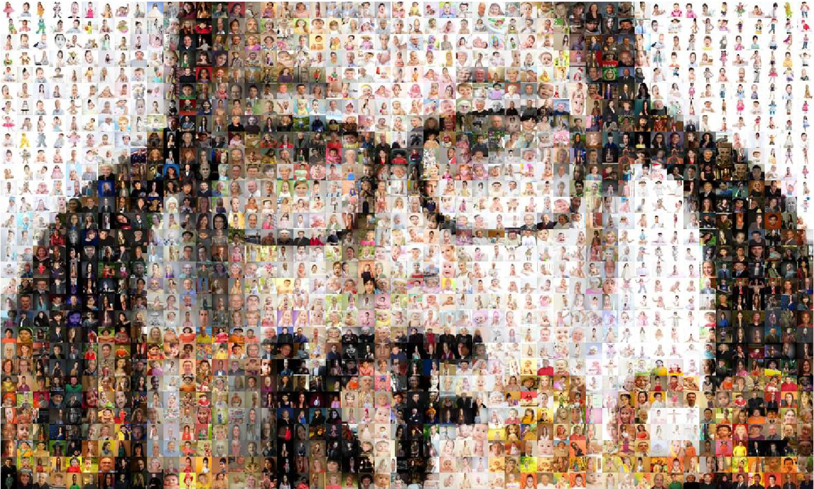

# Human race classification
Human race classification with deep neural networks.

## Dataset
[UTKFace](https://susanqq.github.io/UTKFace/) dataset is a large-scale face dataset with long age span (range from 0 to 116 years old). The dataset consists of over 20,000 face images with annotations of age, gender, and ethnicity (race).

Preprocessed UTKFace dataset is available on [Google.Drive](https://drive.google.com/file/d/1kQL4l8SovFOaw0Oysad3w2iqjQ0w87S9/view?usp=sharing).

## Train
| CNN | Solver | Mode | Iterations | Data |
|-------------|-------------|-------------|-------------|--------------|
| [GoogleNet](https://github.com/BVLC/caffe/tree/master/models/bvlc_googlenet) | SGD | GPU | 40k | 20k |

## Test
Iterations: 100  
Loss-1/Top-1 = 0.925  
Loss-2/Top-1 = 0.93  
Loss-3/Top-1 = 0.9325  

## License
MIT
