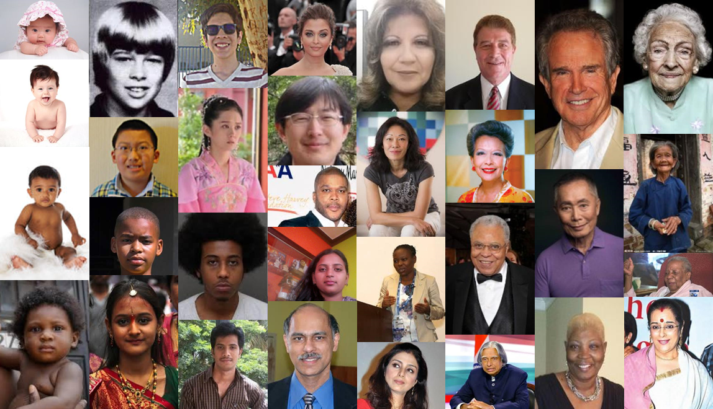

# Human race classification
Human race classification with deep neural networks.

## UTKFace
[UTKFace](https://susanqq.github.io/UTKFace/) dataset is a large-scale face dataset with long age span (range from 0 to 116 years old). The dataset consists of over 20,000 face images with annotations of age, gender, and ethnicity (race).

Preprocessed UTKFace dataset is available on [Google.Drive](https://drive.google.com/file/d/1kQL4l8SovFOaw0Oysad3w2iqjQ0w87S9/view?usp=sharing).

## Caffe
The model was trained and tested with [Caffe](https://github.com/BVLC/caffe). You also can download and use [pre-builded Caffe](https://drive.google.com/file/d/1xmDCY2wywTw9rBzYuESAgDXazy0ck3LB/view?usp=sharing) with [CUDA 9.0](https://developer.nvidia.com/cuda-90-download-archive) and [cuDNN 7.6.4](https://developer.nvidia.com/rdp/cudnn-archive).

## Train/Test
| CNN | Solver | Mode | Iterations | Data | Loss-1/Top-1 | Loss-2/Top-1 | Loss-3/Top-1 |
|-------------|-------------|-------------|-------------|--------------|--------------|--------------|--------------|
| [GoogleNet](https://github.com/BVLC/caffe/tree/master/models/bvlc_googlenet) | SGD | GPU | 40k | 20k | 0.925 | 0.93 | 0.9325 |

## License
MIT
